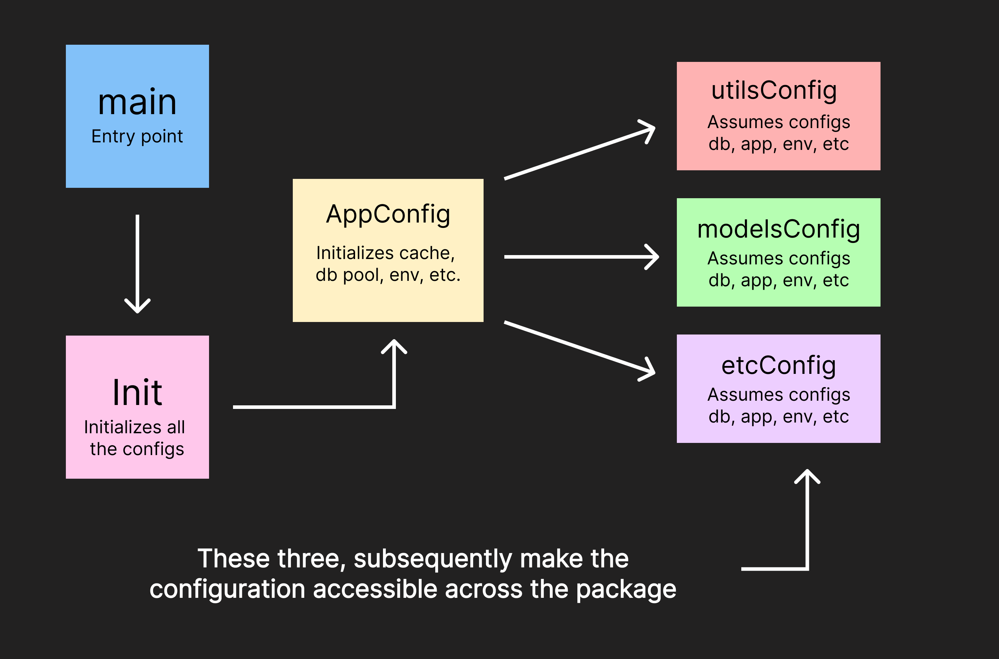

# DEV

## Stack

**Database Design:** [Draw SQL](https://drawsql.app/)

## Architecture

### App Bootstrap

### TODO

- [ ] Update app architecture image _config_arch.png_
- [ ] Find a better way to manage DTO Objects
- [ ] Research whether I am handling dep injection properly
- [ ] Find a way to scan possible null values from db and scan them successfully in JSON [take a read](https://medium.com/aubergine-solutions/how-i-handled-null-possible-values-from-database-rows-in-golang-521fb0ee267)
