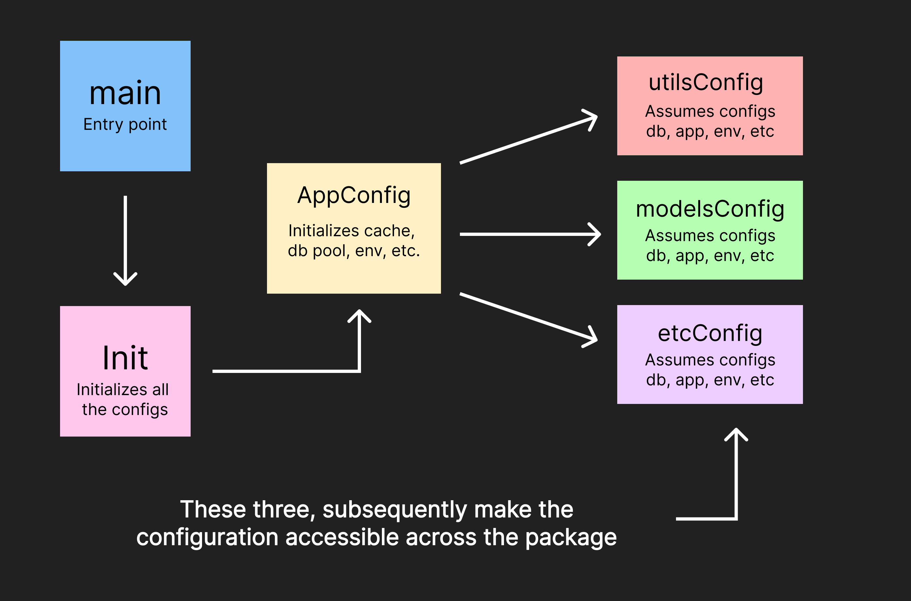

# DEV

## HTTP

### Responding

- **POST:** should receive and respond with `json` data only. It must use the `models.HttpResponse` struct. May leverage the `models.ResponseError` struct.
- **GET:** should respond with `templates` only. It must use the `utils.TemplateRenderer` struct. May leverage the `models.ResponseError` struct.

## Static Content

### CSS

The files `tokens.css` and `app.css` should encompass all the global styles. Everything particular to each view should be located in the files to avoid multiple trips https calls.

## Stack

**Database Design:** [Draw SQL](https://drawsql.app/)

## Architecture

### App Bootstrap

### TODO

- [ ] Update app architecture image _config_arch.png_
- [ ] Find a better way to manage DTO Objects
- [ ] Research whether I am handling dependency injection properly
- [ ] Find a way to scan possible null values from db and scan them successfully in JSON [take a read](https://medium.com/aubergine-solutions/how-i-handled-null-possible-values-from-database-rows-in-golang-521fb0ee267)
- [ ] Find a better way to handle dynamic routes, until then, hard coded strings are fine
